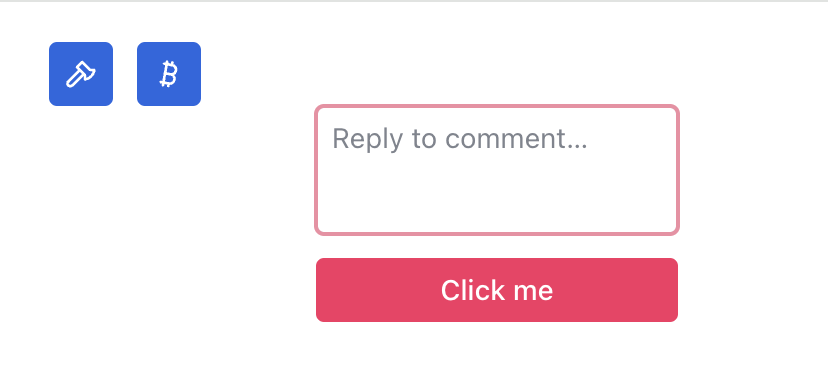

# Radix UI Themes CVA

Use the radix-ui theme css in the same way as [cva](https://cva.style/docs/getting-started/variants), introducing a powerful design system to your application without having to introduce messy frameworks.


See [radix-ui](https://www.radix-ui.com/themes/docs/overview/getting-started) for documentation.

> Note: The complex component needs to have the same anatomy and property set as radix-ui for it to work.


## Usage


> The smallest runnable example can be copied from the [demo](https://github.com/FlatMapIO/radix-ui-themes-cva/tree/main/demo) folder

`index.html`

```html
<html>
  <head>
    <meta charset="UTF-8" />
    <title>Chat</title>
    <link href="//cdn.jsdelivr.net/npm/@radix-ui/themes@latest/styles.css" rel="stylesheet">
    <script src="https://code.iconify.design/iconify-icon/1.0.8/iconify-icon.min.js"></script>
  </head>
  <body>
    <div id="app"></div>
    <script type="module" src="/src/main.tsx"></script>
  </body>
</html>

```

`main.tsx`

```tsx
import { container, flex, iconButton } from 'radix-ui-themes-cva'

export const App = () => {
  return (
    <div class={container.root({ size: 1 })}>
      <div class={[container.inner(), flex({ gap: '3' })]}>
        <button class={iconButton({ size: '1', variant: 'solid' })}>🐰</button>
        <button class={iconButton({ size: '1', variant: 'solid' })}>🥕</button>
      </div>
    </div>
  )
}
```

